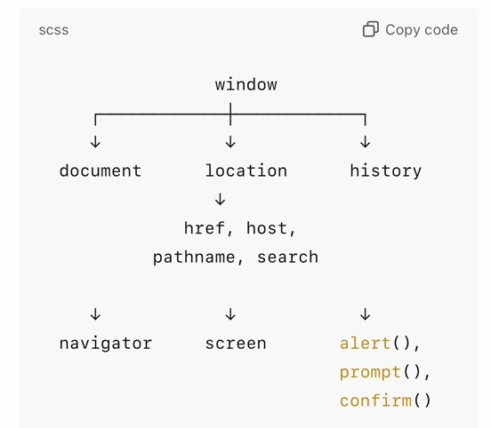
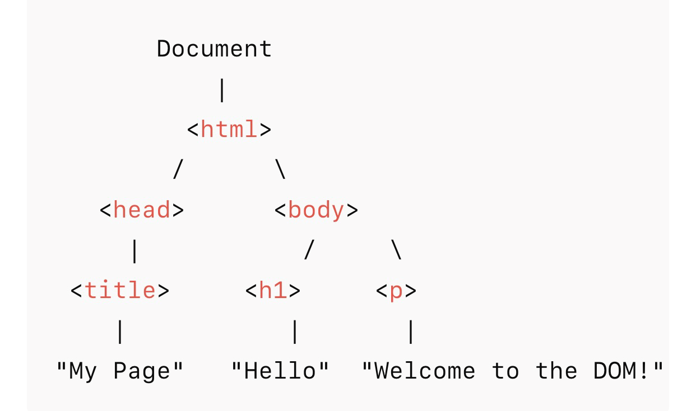

## 🎉 Welcome to Circle 15's Recap  
### A Journey Through JavaScript  
Let’s explore what we’ve learned so far this semester!

---
layout: center
class: text-left text-[.7vw]
---

### 👥 Circle 15 Members

| Name                           | Status       |
|--------------------------------|--------------|
| Ritda Evelyn Aleburu           | ✅ Active    |
| Asogwa Ifunanyachukwu Ruth     | ✅ Active    |
| Marvelous Udugbesi             | ✅ Active    |
| Motunrayo Adeneye              | ✅ Active    |
| Boluwatife Moyaki              | ✅ Active    |
| Omowunmi Olawehinmi            | ✅ Active    |
| Merveille Njikou Naomi         | ✅ Active    |
| Mubarak Bello O                | ✅ Active    |
| Chukwuma Kosiso Jennifer       | ✅ Active    |
| Chioma Ineh                    | ✅ Active    |
| Tochukwu Ejiofor               | ✅ Active    |

> We're committed to learning together and supporting each other through the journey.

---

## 🔗 External Resources

Here are some helpful links and tools that were recommended to be used throughout the semester:

- [Refactoring UI](https://www.refactoringui.com/) — Frontend Masters
- [Learning How to Learn](https://www.coursera.org/learn/learning-how-to-learn?action=enroll) — Coursera


---

## 📚 Topics Covered

- Introduction to JavaScript
- Variables & Data Types
- Operators
- Conditionals
- Loops
- Functions
- Arrays & Objects
- DOM Manipulation

---

## ☆ Introduction to javascript

<br/>


---
## 📌 Topic: JAVASCRIPT
### 👩🏽‍💻 Circle 15 Presentation  
---


## 📚 Javascript

Javascript is a programming language that was initially built for client-side execution, it is used to build web pages and web applications. This language makes a static web page to be dynamic and interactive. JavaScript is therefore executed in the browser.

Traditionally JavaScript is used for client-side only since it is an open source project, developers were able to think, modify it and integrate Nodejs for it to serve as a server-side.

JavaScript was created by a wonderful programmer, **Brendan Eich** in 1995, he then was a programmer at Netscape and he developed it in 10days. At that time JavaScript was called **"Mocha"**, before it latter became what is called now.

To add interactivity to a web page, JavaScript significantly should be added to the web page or part of the web page where we want it. When users come across forms on a web page, they have no idea that adding JavaScript to the web page has made they to be able to fill the form and may also get a feedback message that the form have been submitted.

---

### 📌File structure
JavaScript language is mostly written using a code editor. Each file created for JavaScript must be written in a `.js` extension for proper execution. The file name can be called `main.js`, `index.js` or `script.js.`

### Implementation
There are different ways of implementing JavaScript depending what you want to do with it.

For a client-side execution: JavaScript can be used along it HTML and CSS. It can be implemented internally that is by adding the script tag `<script> </script>`inside the HTML file. It will enhance the manipulation of the html tags to modify the content.
It can also be implemented externally by isolating its logic in a whole new file with a .js extension and hence imported in the HTML file for execution.
`<script src='./main.js'></script>`.

For Server side extension: it is only implemented in the .js file extension which can run using the command

```javascript
node server.js
```

This command will work if you have saved the file as `server.js` and vice versa.
---

## 📝Data types
Data is the kind of information that the program possesses.


They are two type of data; **Primitive** and **Composite** data types.

- **Primitive** data type is the set of individual data type that make up a sentence or statement.

There are different types of primitive data types

- String: This includes letters, words, or sentences which are denoted starting with single quotes ('') double quotes ("") or backticks(``).

```javascript
let greeting =  "Hello World";
var community = 'It is Dev Community'; 
var fullName = `Hi, I am ${name}`;
```

---

- Number: This represents number; integer and floating point. Examples are 5, 10, 9.6.

```javascript
var age = 30
const simpleInterest = 30.9
```

- Boolean: This represents logical values; true and false.

```javascript
const isOpen = false;
var isExpanded = true;
```

- Undefined: This represents unassigned variable. It is when a variable is declared but not assigned to a value.

```javascript
var greeting;
```

- Null: This represents the absence of value.

```javascript
let unSpecific = null;
```

---

- **Non-primitive or Composite data type**

This is the collection of primitive data types. There are three types of composite data types; arrays and object.

- a. Array: An array is the collection of values. It can numbers, string and other data types as values. They are special kind of object where the key is not visible until it is accessed.

```javascript
let fruits = ["apple", "banana"];
```

<br/>

- b. Objects: An object is a stand alone entity. They are true representation of data that exist in key-value pair where key is the variable. It is denoted using curly bracket {}.

```javascript
const student = {
name: "Motunrayo", 
age: 30, 
language: "Yoruba" 
}
```
---

## 📚 Arrays

<br/>
<br/>
<br/>


---

## ✅ What is an Array?

An **array** is a special variable used to **store multiple values** in a single variable name. It helps in organizing and managing collections of data efficiently.  It can numbers, string and other data types as values. 


```javascript
let myArray = []
```


If we check the console to know the type of of the myArray.This will output object.

```javascript
let myArray = [];
console.log(typeof(myArray)); //object
console.log(typeof myArray); //object
```


Think of it like a container holding items in a specific order. Each item can be accessed using its index.

```javascript
let fruits = ["apple", "banana", "cherry"];
console.log(fruits[0]); // Output: apple 
```


Array can hold all kind of data types including numbers, objects and nested array.

```javascript
let myArray = [42, "Hello, World!", true, { name: "Alice", age: 30 }, [1, 2, 3], ]

```

---

## **To create array, you can create it by using**:

<br/>

- To create array, you can create it by using:


```javascript
let fruits = ["apple", "banana"];
console.log(fruits);// ["apple", "banana"]
```

- Using Arrow constructor

```javascript
let colors = new Array("pink", "red", "brown");
console.log(colors);// ["pink", "red", "brown"]
```


To access an array, you have to use indexing method. Array are indexed by number, starting from 0. It is zero-index based starting from 0 to 9. It tells the position of the value, if interchanged the position also change.

```javascript
let person =["John", "Doe", "Hope"]
// Accessing the elements
console.log(person[0]); // John
console.log(person[1]);// Doe
console.log(person[2]);// Hope
```

---

Another way to access is using the method length property `arrayName.length` .

```javascript
const fruits = ["Tangerine", "Banana", "Cherry", "Pawpaw"];  
console.log(fruits.length)// 4
console.log(fruits[fruits.length -1])//Pawpaw
```

<br/>

```javascript
const fruits = ["Tangerine", "Banana", "Cherry", "Pawpaw"];  
console.log(fruits.length)// 4
console.log(fruits[fruits.length -2]) //Cherry
```

<br/>

```javascript
const myArray = [];
console.log(myArray.length); // 0
```
<br/>

```javascript
const mixedArray = [20, 4, "Pawpaw", "Watermelon", 6, 7];  
console.log(mixedArray.length) // 6
console.log(mixedArray[mixedArray.length - 1]) // 7
```

<br/>
---


## ✅ Array Methods

<br/>


<br/>

In JavaScript, array methods are built-in functions that help you manipulate and interact with arrays.These methods make it easier to write shorter and cleaner code.They let you add, remove, update, loop through, and transform array elements with cleaner code. Some of the common array methods includes:


#### 🔸Push

Adds a new item to the end of an array.

```javascript
fruits.push("orange");
console.log(fruits); // ["apple", "banana", "cherry", "orange"]
```
---

#### 🔹Pop

Removes the last element from an array.

```javascript
fruits.push("orange");
console.log(fruits); // ["apple", "banana", "cherry", "orange"]
```
<br/>

#### 🔸Shift

Removes the first element from an array.

```javascript
let fruits = ["apple", "banana", "orange"];
fruits.shift();
console.log(fruits); // ["banana", "orange"]
```
<br/>

#### 🔹Unshift

Adds one or more elements to the beginning of an array.

```javascript
let fruits = ["banana", "orange"];
fruits.unshift("apple");
console.log(fruits); // ["apple", "banana", "orange"]
```
---

#### 🔸Slice
Returns a shallow copy of a portion of an array.
To output a new array from the original array without modifying the array. In this case the output will start from the startIndex and stop at the endIndex - startIndex.

```javascript
myArray.slice(startIndex, endLength)
```

```javascript
let fruits = ["apple", "banana", "orange", "grape"];
let sliced = fruits.slice(1, 3);
console.log(sliced); // ["banana", "orange"]
```

From the example above the output is `["banana", "orange"]` in which the startIndex is 1 and the counting start from there to the endIndex which is 3 - the startIndex which is 1. This will be equal to 2 which will be the length of where it stops. At the end, it will output 2 items.

#### 🔹Splice
Changes the contents of an array by removing or replacing existing elements.


```javascript
let fruits = ["apple", "banana", "orange"];
fruits.splice(1, 1, "grape");
console.log(fruits); // ["apple", "grape", "orange"]
```
---

#### 🔸ForEach

Executes a function for each element in the array

```javascript
let fruits = ["apple", "banana", "orange"];
fruits.splice(1, 1, "grape");
console.log(fruits); // ["apple", "grape", "orange"]

```

---
 
## 📚 Loops  

<br/>

### 🔄 What Are Loops?

Loops are used to run the same block of code **multiple times**.

They are useful when you want to **repeat an action**, such as iterating over a list or counting.


### ✅ Why Use Loops?

- To avoid repeating code manually
- To iterate through arrays, objects, or numbers
- To perform repeated tasks efficiently

---

## 🌀 Types of Loops in JavaScript

<br/>


- `for`
- `while`
- `do...while`
- `for...of`
- `for...in`

<br/>

### 🔸 for Loop


Used when you know how many times to run the loop.

```js
for (let i = 0; i < 5; i++) {
  console.log("Number:", i);
}
```
---

Output

```js
Number: 0  
Number: 1  
Number: 2  
Number: 3  
Number: 4
```

<br/>

### 🔹 Example: Looping Through an Array

```js
const fruits = ["apple", "banana", "cherry"];

for (let i = 0; i < fruits.length; i++) {
  console.log(fruits[i]);
}

```
<br/>
Output

```js
apple  
banana  
cherry

```
---

### 🔸while Loop


Runs while a condition is true.

```js
let i = 0;
while (i < 10) {
  console.log("Count:", i);
  i++;
}

```

Output

```js
Count: 0  
Count: 1  
Count: 2
Count: 3
Count: 4
Count: 5  
Count: 6
Count: 7
Count: 8
Count: 9


```
---

### 🔸do...while Loop

Runs at least once, then continues while condition is true.

```js
let i = 0;
do {
  console.log("Step:", i);
  i++;
} while (i < 2);


```

Output

```js
Step: 0  
Step: 1

```
<br/>

### 🔸for...of Loop

Loops through the values of an iterable like an array.

```js
const colors = ["red", "blue", "green"];

for (let color of colors) {
  console.log(color);
}

```
---

Output

```js
red  
blue  
green
```
<br/>

### 🔸for...in Loop

Loops through the keys/indexes of an object or array. This can be used to loop through objects as well.

```js
const student = {
  name: "Jhennifer",
  age: 22,
  course: "Frontend"
};

for (let key in student) {
  console.log(key + ": " + student[key]);
}


```
---

Output

```js
name: Jhennifer  
age: 22  
course: Frontend

```

<br/>

### 🔸break and continue

###### break : exits the loop early

###### continue: skips to the next iteration

<br/>
```js
for (let i = 0; i < 5; i++) {
  if (i === 3) break;
  console.log(i);
}

```

Output

```js
0  
1  
2

```
---

```js
for (let i = 0; i < 5; i++) {
  if (i === 2) continue;
  console.log(i);
}


```

Output

```js
0  
1  
3  
4

```

<br/>

---


## 📚 Objects

<br/>

 ### ✅ What Are Objects?

Objects are **collections of key-value pairs** where keys (or properties) are strings and their values can be any data type. These values can be strings, numbers, booleans, arrays, functions, or even other objects. They let you group related data and functions together. 
In JavaScript, almost everything is an object — arrays, functions, and even dates!

<br/>

### ✅ Basic Syntax

```js
const person = {
  name: "Jhennifer",
  age: 22,
  isStudent: true
};
```
<br>

### 🧾 Accessing Object Properties

There is more than one way to access object values. You can use the **dot notation** or **bracket notation**.

---

#### Dot Notation

Use dot notation to directly access a property by name.

```js
const car = {
    brand: Toyota,
    model: Corolla,
    year: 2020
}

console.log(car.brand); // Toyota
```
<br>

#### Bracket Notation

Use bracket notation when property names are dynamic or contain special characters.

```js
const car = {
    brand: Toyota,
    model: Corolla,
    year: 2020
}

console.log(car['model']); // Corolla
```

---

### ✍️ Modifying Object Properties

You can update or add new properties like this:


```js
person.age = 23;
person.course = "Frontend Development";
```

**Resulting object:**

```js
{
  name: "Jhennifer",
  age: 23,
  isStudent: true,
  course: "Frontend Development"
}
```

<br>

### ❌ Deleting a Property

```js
delete person.isStudent;
```

Now the `isStudent` property is removed from the object.

---

### 🔁 Looping Through an Object

Use `for...in` to loop through the keys:

```js
for (let key in person) {
  console.log(key + ": " + person[key]);
}
```

<br>

### ✅ Object Methods

Objects can have **methods** — functions stored as property values.


```js
const dog = {
  name: "Snow",
  bark: function() {
    console.log("Woof!");
  }
};

dog.bark(); // Woof!
```

---

### ✅ Nested Objects

Objects can be nested inside other objects.

```js
const user = {
  name: "Chioma",
  address: {
    city: "Lagos",
    country: "Nigeria"
  }
};

console.log(user.address.city); // Lagos
```


## 🧪 Example: Object with Array and Method

```js
const student = {
  name: "Ada",
  subjects: ["Math", "English", "Science"],
  greet: function() {
    return "Hello, I'm " + this.name;
  }
};

console.log(student.greet()); // Hello, I'm Ada
```


---

## 📚Functions
<br/>

###  ✅ What is a Function?

A **function** is a reusable block of code designed to perform a specific task. It helps break your program into smaller, manageable parts. You can call a function multiple times without rewriting code.

## 🔹Function Syntax

```js
function functionName(parameters) {
  // code to be executed
}
```

Example

```js
 function greet(name) {
  console.log("Hello, " + name + "!");
}

greet("Jhennifer");
```

---

## 🧰 Types of Function


- Function Declaration
```js
function add(a, b) {
  return a + b;
}

console.log(add(3, 4)); // 7
```

- Function Expression
```js
const multiply = function (x, y) {
  return x * y;
};

console.log(multiply(5, 2)); // 10

```

- Arrow Function (ES6)

##### This is a shorter and cleaner way to write functions.
```js
const divide = (a, b) => a / b;

console.log(divide(10, 2)); // 5


```
---

- Anonymous Function 

##### Functions without a name, often used as callbacks.
```js
setTimeout(function () {
  console.log("This runs after 2 seconds");
}, 2000);

```
<br/>

## 🔄 Returning Values from Functions
#### Functions can return values using the return keyword.

```js
function square(num) {
  return num * num;
}

const result = square(6);
console.log(result); // 36
```
<br/>

## ⚙️ Parameters vs Arguments
Parameters are variables in function definition. Arguments on the other hand are actual values passed when calling the function

---

```js
Copy code
function sayHello(name) {  // name is a parameter
  console.log("Hello, " + name);
}

sayHello("Chioma"); // "Chioma" is the argument
```
<br/>

## 🔸 Why Use Functions?
1. Improves code reusability

2. Easier debugging

3. Clean and organized code

4. Helps divide complex problems


---

## 📚 BOM  and DOM Tree

**BOM(Browser object model)**

Window object main features are BOM,DOM and JavaScript Object. 
BOM represents the additional features provided by the browser.It is a set of objects provided by the browser (not JavaScript itself) that allows JavaScript to interact with the browser window. 
 
<br/>

### 🔹Main BOM components

- *window*: The global object representing the browser window.
- *Document*: This is the part of the DOM via the BOM(window.document)
- *Location*: This gives URL details and can redirect pages(windows.location.href)
- *Navigator*: This gives browser info like name, version, user agent.
- *Screen*:Gives info about the users screen(width, height)
- *History*:This lets you move forward/backward in history 
- *Alert/prompt/confirm*: Dialogue  boxes to interact with users.

---

### 🔸Core BOM objects 



<br/>

###  🌐 BOM Examples 

```javascript
console.log(window.location.href);//Get current URL
```

```javascript
console.log(Window.navigator.userAgent);//Get browser info 
```

```javascript
window.location.reload();// reload the page
```

```javascript
window.alert('Hello BOM');
```

---

### 🌳DOM Tree

The DOM is a programming interface that allows JavaScript to read and manipulate HTML and XML document. It turns the page into a tree-like structure where each element is a node.

A simple HTML Page 

```html
<!DOCTYPE html>
<html>
<head>
<title>My Page</title>
</head>
<body>
<h1>Hello</h1>
<p>Welcome to the DOM!</p>
</body>
</html>
```
---

### 🔸Core DOM objects

An illustration of a DOM tree structure.




---
 
### 🔹DOM Method and Properties
<br/>

- *document.getElementById()*: Selects element by ID
- *document.querySelector()*: Selects first matching element
- *element.innerHTML*: Gets/sets HTML content
- *element.textContent*: Gets/sets text content
- *element.setAttribute()*:	Sets an attribute
- *element.classList.add()*: Adds a CSS class
- *element.style.color*: Changes inline styles
- *document.createElement()*: Creates new HTML element

<br/>

### 🔸DOM Examples 

```javascript
const heading = document.queryselector(‘hi’); 
console.log(heading.text content); //Hello DOM
```
```javascript
const container = document.getElemmentById(‘container’);
container.style.background =‘lightblue’
```

---

##  📚 REST AND SPREAD OPERATORS

<br>

#### ✅ What is the Rest Operator?

The **Rest operator** (`...`) allows you to collect multiple elements and package them into a single array. It is mainly used in **function parameters** to gather all remaining arguments.

#### Example: Using Rest in Function Parameters

```js
function sum(...numbers) {
  return numbers.reduce((acc, val) => acc + val, 0);
}

console.log(sum(1, 2, 3, 4)); // 10
```
<br>

#### 🔹 Use Cases for the Rest Operator

- **Variable number of arguments**: You don’t know how many arguments will be passed to the function.
- **Making reusable utilities**: Functions like `sum()`, `max()`, `min()` that need flexible input.
- **Destructuring objects or arrays**: Capture the "rest" of the data after pulling out key parts.

---

```js
const [first, ...rest] = [1, 2, 3, 4];
console.log(first); // 1
console.log(rest);  // [2, 3, 4]
```

<br>

#### ✅ What is the Spread Operator?

The **Spread operator** (`...`) allows you to **unpack elements** from arrays or objects. It copies or expands existing data into new structures.

#### Example: Spreading in Arrays

```js
const fruits = ['apple', 'banana'];
const moreFruits = [...fruits, 'orange', 'mango'];

console.log(moreFruits); 
// ['apple', 'banana', 'orange', 'mango']
```
<br>
 
#### 🔸 Use Cases for the Spread Operator (Arrays)

- **Copying arrays** without mutation:

```js
const original = [1, 2, 3];
const copy = [...original];

```
---

- **Combining arrays**:

```js
const boys = ['John', 'Mike'];
const girls = ['Sara', 'Anna'];
const all = [...boys, ...girls];
```

- **Passing array elements as function arguments**:

```js
const nums = [4, 5, 6];
console.log(Math.max(...nums)); // 6
```

<br>

#### Example: Spreading in Objects

```js
const user = { name: 'Jhennifer', age: 22 };
const updatedUser = { ...user, country: 'Nigeria' };

console.log(updatedUser);
// { name: 'Jhennifer', age: 22, country: 'Nigeria' }
```

<br>

#### 🔹Use Cases for the Spread Operator (Objects)

- **Copying objects**:

```js
const copy = { ...user };
```

---

- **Merging objects**:

```js
const extraInfo = { hobby: 'coding' };
const fullProfile = { ...user, ...extraInfo };
```

- **Overwriting properties**:

```js
const olderUser = { ...user, age: 25 };
```

<br>

### Rest vs Spread Summary

| Operator        | Symbol | Purpose                              | Common Use Cases                                |
|-----------------|--------|--------------------------------------|-------------------------------------------------|
| Rest Operator   | `...`  | Collects multiple items into one     | Function parameters, array/object destructuring |
| Spread Operator | `...`  | Spreads one item into multiple parts | Cloning, merging, passing as arguments          |

---

## 📚 CALLBACK FUNCTIONS

A **callback function** is a function passed into another function as an argument, which is then invoked inside the outer function to complete some kind of routine or action.
In other words, a callback function is a function definition that is passed in as the argument of another function’s invocation.  
The callback will never run until the encompassing function executes it when the time comes. Therefore, the callback is at the mercy of the function receiving it.

Functions are **objects** in JavaScript. This means:

- They have the properties and methods of objects.
- They can be passed around in the code.
- They can take other functions as arguments.
- They can be returned from other functions.
- They can even have properties of their own.

This is why functions passed as arguments are known as **Callback functions**.

---

##  🔸WHAT DO WE NEED CALLBACKS FOR?

JavaScript code runs from top to bottom. This is called **sequential execution**. However, there are times when we want code to wait until another task is completed or an event happens.  
This is called **asynchronous execution**.

## Example: Using `setTimeout()` for Callback Simulation

To simulate waiting for data from an external source, we use `setTimeout()` — a JavaScript function that delays execution.

### Sample Code:

```js
function fetchData(callback) {
  console.log("Fetching data...");
  setTimeout(() => {
    console.log("Data fetched!");
    callback();
  }, 5000);
}
```

---

```

function processData() {
  console.log("Processing data...");
}

fetchData(processData);
```

**Output (with delay):**
```
Fetching data...
(wait 5 seconds)
Data fetched!
Processing data...
```

This delay simulates something like a **server request**.

---

##  ✅ WAYS OF CREATING AND USING CALLBACK FUNCTIONS

<br>

### 🔹 Anonymous Function

This is an anonymous function ( a function without a name) created and passed as an argument at the same time.

```js
setTimeout(function() {
  console.log("Callback from anonymous function");
}, 1000);
```

<br>

### 🔸 Arrow Function

Arrow function is a cleaner syntax for short callbacks.

```js
setTimeout(() => {
  console.log("Callback from arrow function");
}, 1000);
```

---

### 🔹 Defined Function as Argument

Here we define the function first, then pass it as a callback.

```js
function greet() {
  console.log("Hello from callback!");
}

function runCallback(callback) {
  callback();
}

runCallback(greet);
```

---


